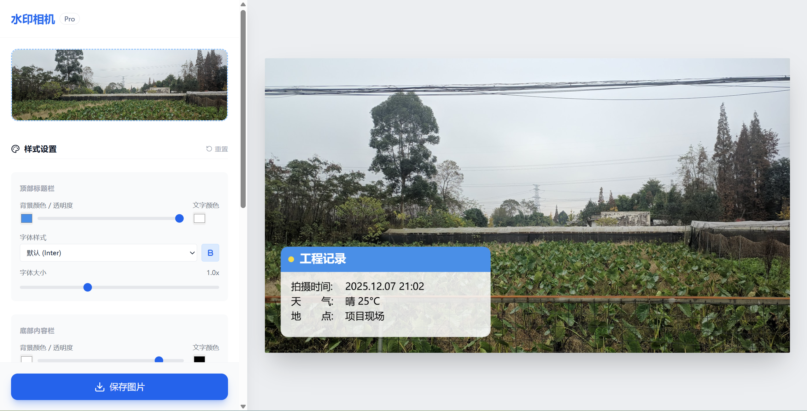
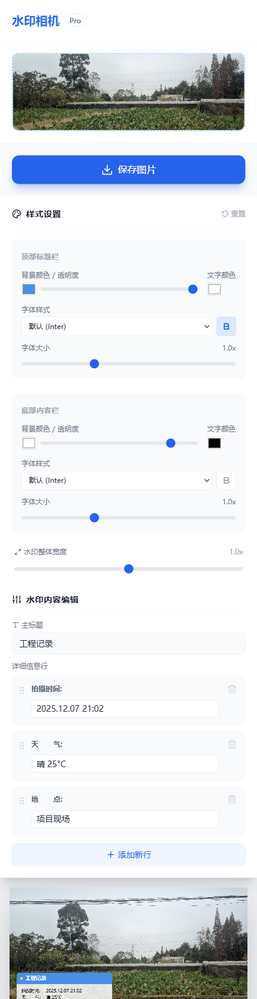

# 水印相机 Pro

<div align="center">

**专业的工程记录水印工具**

一款基于 Web 的专业水印相机应用，专为工程、建筑、施工等行业打造。支持自定义水印样式、实时预览、离线使用，让现场记录更加规范和专业。

[](https://vercel.com/new/clone?repository-url=https://github.com/aliveyang/g3-WatermarkCamera)

[在线体验](#) | [功能特性](#功能特性) | [快速开始](#快速开始)

</div>

---

## ✨ 功能特性

### 🎨 高度自定义
- **水印样式自由调整**：独立设置标题栏和内容栏的颜色、透明度、字体、大小
- **多字体支持**：内置多种中英文字体，包括微软雅黑、黑体、楷体、宋体等
- **灵活布局**：可调整水印整体宽度和各部分比例
- **实时预览**：所见即所得，修改即时生效

### 📝 智能内容管理
- **动态信息行**：可添加/删除任意数量的信息项
- **自动时间戳**：打开应用自动更新拍摄时间
- **本地持久化**：自动保存配置，下次使用无需重新设置
- **自定义标签**：支持自定义标签名称和内容

### 📱 响应式设计
- **移动端优化**：专门为移动设备优化的操作流程
- **桌面端支持**：大屏幕下提供更专业的编辑体验
- **PWA 应用**：支持安装到设备，可离线使用

### 🖼️ 高质量输出
- **原图分辨率**：水印渲染基于原图尺寸，保证清晰度
- **Canvas 绘制**：高质量图像处理，文字渲染精细
- **JPEG 导出**：优化压缩质量，平衡文件大小和清晰度

---

## 📸 效果展示

### 桌面端界面


*左侧控制面板，右侧实时预览，专业高效的工作流程*

---

### 移动端界面


*移动端优化布局：上传 → 保存 → 预览 → 配置，操作流畅便捷*

---

## 🚀 快速开始

### 环境要求
- Node.js >= 16.0.0
- npm 或 yarn

### 安装依赖
```bash
npm install
```

### 开发模式
```bash
npm run dev
```
访问 http://localhost:5173 即可开始使用

### 生产构建
```bash
npm run build
```
构建产物位于 `dist` 目录

### 预览构建结果
```bash
npm run preview
```

---

## 🛠️ 技术栈

- **框架**: React 18.3 + TypeScript 5.6
- **构建工具**: Vite 5.4
- **样式**: Tailwind CSS（内联类）
- **图标**: lucide-react
- **PWA**: vite-plugin-pwa
- **AI 集成**: Google Gemini API（可选）

---

## 📖 使用说明

### 基础使用流程

1. **上传照片**
   - 点击"上传照片"区域选择图片
   - 支持任意尺寸的 JPG/PNG 格式图片
   - 上传后显示缩略图预览，可随时更换

2. **编辑水印内容**
   - 修改主标题（如"工程记录"、"施工日志"等）
   - 编辑详细信息行（时间、天气、地点等）
   - 点击"添加新行"增加更多信息项
   - 点击删除图标移除不需要的信息行

3. **调整水印样式**
   - **顶部标题栏**：设置背景色、透明度、文字颜色、字体样式和大小
   - **底部内容栏**：独立设置内容区域的样式参数
   - **整体布局**：调整水印框的宽度比例

4. **保存图片**
   - 点击"保存图片"按钮下载带水印的照片
   - 图片以原始分辨率输出，保证清晰度
   - 文件名格式：`watermark_时间戳.jpg`

### 高级功能

#### 样式预设保存
应用会自动保存你的样式设置和水印内容，下次打开时自动恢复上次的配置。

#### 样式重置
点击样式设置区域右上角的"重置"按钮，可恢复默认样式。

#### 字体加粗
每个区域（标题栏/内容栏）都可以独立开启或关闭字体加粗效果。

---

## 📁 项目结构

```
WatermarkCamera/
├── src/
│   ├── App.tsx                 # 主应用组件
│   ├── index.tsx              # 入口文件
│   ├── types.ts               # TypeScript 类型定义
│   ├── utils/
│   │   └── canvasUtils.ts     # Canvas 绘制工具函数
│   └── services/
│       └── geminiService.ts   # AI 图像分析服务（可选）
├── public/                     # 静态资源
├── dist/                       # 构建输出目录
├── Effect1.png                 # 桌面端效果图
├── Effect2.png                 # 移动端效果图
├── vite.config.ts             # Vite 配置
├── tsconfig.json              # TypeScript 配置
└── package.json               # 项目依赖
```

---

## 🔧 配置说明

### 环境变量（可选）

如需使用 AI 图像分析功能，创建 `.env.local` 文件：

```env
VITE_API_KEY=your_gemini_api_key_here
```

> **注意**：AI 功能是可选的，不配置 API Key 也能正常使用所有核心功能。

---

## 💡 应用场景

- 🏗️ **工程施工记录**：现场拍照自动添加时间、天气、位置等信息
- 🔧 **设备维护日志**：记录设备状态、维护时间、责任人等
- 📋 **质量检查报告**：标注检查项目、检查结果、检查人员
- 🌳 **环境监测记录**：记录监测时间、地点、天气、数据等
- 📦 **物流配送凭证**：标注配送时间、地点、收货人信息

---

## 🤝 贡献

欢迎提交 Issue 和 Pull Request！

如果这个项目对你有帮助，请给个 ⭐️ Star 支持一下！

---

## 📄 开源协议

MIT License - 详见 [LICENSE](LICENSE) 文件

---

## 🙏 致谢

- 感谢 [React](https://react.dev/) 和 [Vite](https://vitejs.dev/) 提供的优秀开发体验
- 感谢 [Tailwind CSS](https://tailwindcss.com/) 提供的灵活样式方案
- 感谢 [Lucide](https://lucide.dev/) 提供的精美图标库

---

<div align="center">

Made with ❤️ for engineers and professionals

</div>
